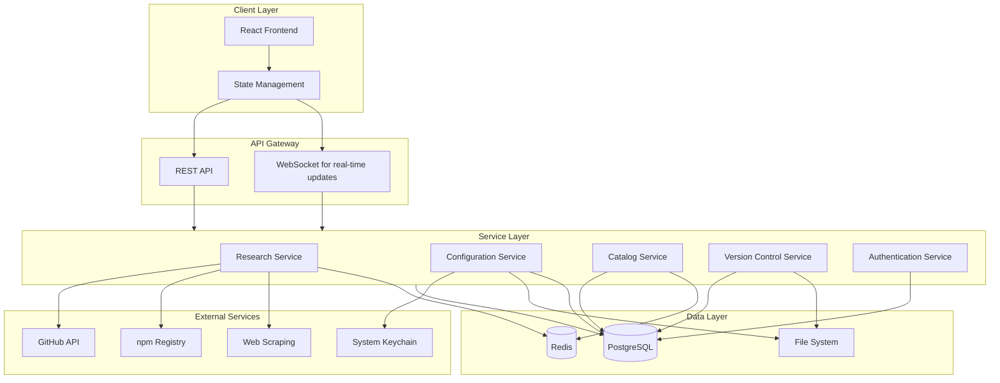
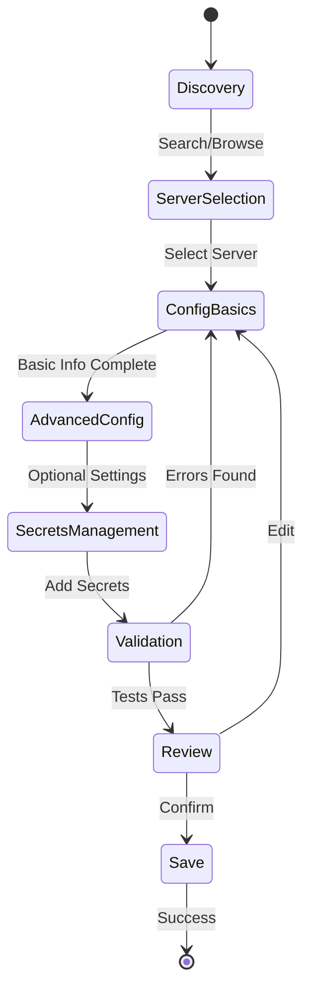
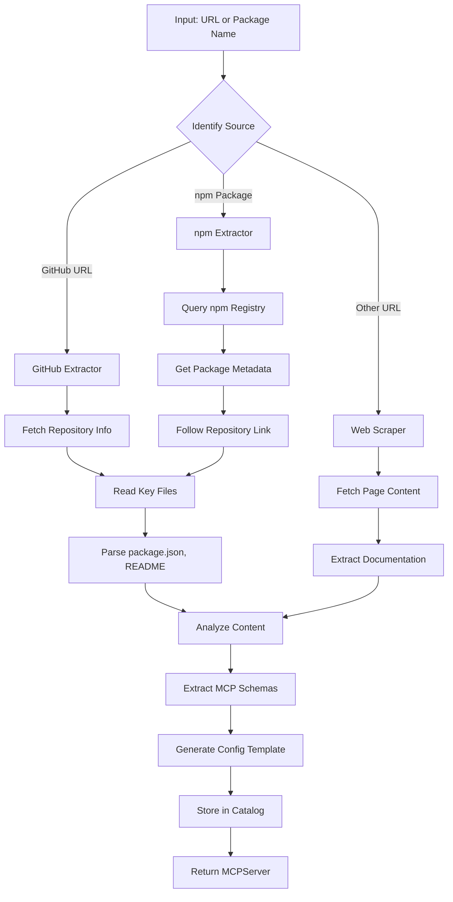
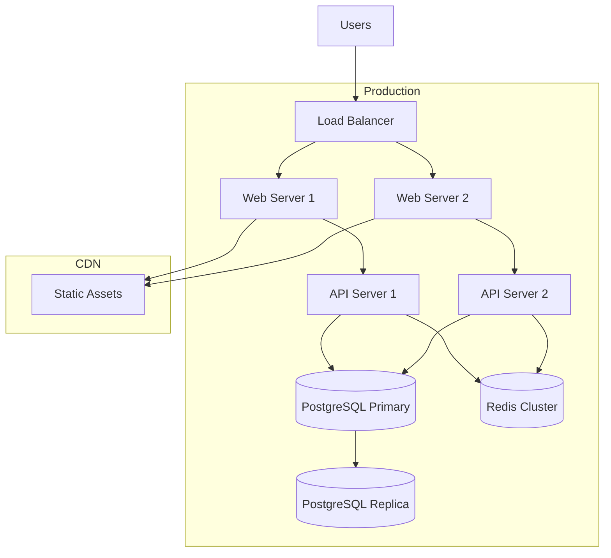

# MCP Wizard - Architecture Plan

## Executive Summary

MCP Wizard is a web application designed to simplify the discovery, configuration, and management of Model Context Protocol (MCP) servers. It provides an intelligent research system that extracts metadata from various sources and a wizard-style interface for collecting and persisting configuration information.

## System Overview

### Core Capabilities
- **Discovery & Research**: Search and analyze MCP servers from GitHub, npm, and other sources
- **Intelligent Configuration**: Wizard-style interface with smart defaults and validation
- **Multi-Format Support**: Generate configurations for Claude Desktop and other MCP clients
- **Secure Storage**: Integration with system keychain for sensitive credentials
- **Version Control**: Track configuration changes over time
- **Full CRUD**: Create, read, update, and delete MCP server configurations

## Technology Stack

### Frontend
- **Framework**: React 18+ with TypeScript
- **State Management**: Redux Toolkit or Zustand
- **UI Library**: Material-UI or Tailwind CSS + Headless UI
- **Form Management**: React Hook Form with Zod validation
- **HTTP Client**: Axios or Fetch API
- **Routing**: React Router v6

### Backend
- **Runtime**: Node.js 18+ with TypeScript
- **Framework**: Express.js or Fastify
- **API Style**: RESTful with potential GraphQL layer
- **Database**: PostgreSQL for structured data, Redis for caching
- **ORM**: Prisma or TypeORM
- **Authentication**: JWT with refresh tokens
- **File System**: Node.js fs/promises for config file management

### External Integrations
- **GitHub API**: Repository and file content access
- **npm Registry API**: Package metadata retrieval
- **System Keychain**: node-keytar for secure credential storage
- **Web Scraping**: Puppeteer or Cheerio for documentation extraction

### DevOps
- **Containerization**: Docker with docker-compose
- **CI/CD**: GitHub Actions
- **Testing**: Jest, React Testing Library, Supertest
- **Linting**: ESLint, Prettier
- **Type Checking**: TypeScript strict mode

## System Architecture



## Data Models

### MCP Server Catalog Entry
```typescript
interface MCPServer {
  id: string;
  name: string;
  description: string;
  source: 'github' | 'npm' | 'manual';
  sourceUrl: string;
  packageName?: string;
  version: string;
  author: string;
  license: string;
  tags: string[];
  
  // Extracted metadata
  readme: string;
  tools: ToolSchema[];
  resources: ResourceSchema[];
  prompts: PromptSchema[];
  
  // Configuration templates
  configTemplate: ConfigTemplate;
  requiredParams: ConfigParam[];
  optionalParams: ConfigParam[];
  
  // Metadata
  createdAt: Date;
  updatedAt: Date;
  lastResearchedAt: Date;
  popularity: number;
  verified: boolean;
}

interface ToolSchema {
  name: string;
  description: string;
  inputSchema: JSONSchema;
}

interface ResourceSchema {
  uri: string;
  name: string;
  description: string;
  mimeType?: string;
}

interface PromptSchema {
  name: string;
  description: string;
  arguments?: PromptArgument[];
}

interface ConfigTemplate {
  command: string;
  args?: string[];
  env?: Record<string, string>;
  transport?: 'stdio' | 'sse';
}

interface ConfigParam {
  key: string;
  type: 'string' | 'number' | 'boolean' | 'path' | 'secret';
  description: string;
  required: boolean;
  default?: any;
  validation?: ValidationRule[];
}
```

### User Configuration
```typescript
interface UserConfig {
  id: string;
  userId: string;
  serverId: string;
  name: string;
  enabled: boolean;
  
  // Configuration values
  command: string;
  args: string[];
  env: Record<string, string>;
  
  // Sensitive data references (stored in keychain)
  secrets: SecretReference[];
  
  // Client format
  targetClient: 'claude-desktop' | 'custom';
  customFormat?: string;
  
  // Metadata
  createdAt: Date;
  updatedAt: Date;
  version: number;
}

interface SecretReference {
  key: string;
  keychainId: string;
  description: string;
}

interface ConfigVersion {
  id: string;
  configId: string;
  version: number;
  config: UserConfig;
  changeDescription: string;
  createdAt: Date;
  createdBy: string;
}
```

## API Design

### Research Endpoints
```
POST   /api/research/discover
  Body: { query: string, source?: 'github' | 'npm' | 'all' }
  Response: { servers: MCPServer[] }

POST   /api/research/analyze
  Body: { url: string, type: 'github' | 'npm' }
  Response: { server: MCPServer }

GET    /api/research/status/:jobId
  Response: { status: 'pending' | 'complete' | 'failed', result?: MCPServer }
```

### Catalog Endpoints
```
GET    /api/catalog/servers
  Query: { search?, tags?, page?, limit? }
  Response: { servers: MCPServer[], total: number }

GET    /api/catalog/servers/:id
  Response: { server: MCPServer }

POST   /api/catalog/servers
  Body: { server: MCPServer }
  Response: { server: MCPServer }

PUT    /api/catalog/servers/:id
  Body: { server: Partial<MCPServer> }
  Response: { server: MCPServer }

DELETE /api/catalog/servers/:id
  Response: { success: boolean }
```

### Configuration Endpoints
```
GET    /api/configs
  Query: { userId?, enabled? }
  Response: { configs: UserConfig[] }

GET    /api/configs/:id
  Response: { config: UserConfig }

POST   /api/configs
  Body: { config: UserConfig }
  Response: { config: UserConfig }

PUT    /api/configs/:id
  Body: { config: Partial<UserConfig> }
  Response: { config: UserConfig }

DELETE /api/configs/:id
  Response: { success: boolean }

POST   /api/configs/:id/validate
  Response: { valid: boolean, errors?: ValidationError[] }

POST   /api/configs/:id/export
  Body: { format: 'claude-desktop' | 'custom' }
  Response: { config: string }
```

### Version Control Endpoints
```
GET    /api/configs/:id/versions
  Response: { versions: ConfigVersion[] }

GET    /api/configs/:id/versions/:version
  Response: { version: ConfigVersion }

POST   /api/configs/:id/rollback/:version
  Response: { config: UserConfig }
```

### Keychain Endpoints
```
POST   /api/keychain/store
  Body: { key: string, value: string, description: string }
  Response: { keychainId: string }

GET    /api/keychain/:id
  Response: { value: string }

DELETE /api/keychain/:id
  Response: { success: boolean }
```

## Frontend Architecture

### Component Hierarchy
```
App
├── Layout
│   ├── Header
│   ├── Navigation
│   └── Footer
├── Pages
│   ├── Dashboard
│   │   ├── ConfigList
│   │   ├── QuickActions
│   │   └── RecentActivity
│   ├── Discovery
│   │   ├── SearchBar
│   │   ├── CatalogBrowser
│   │   └── ServerCard
│   ├── Wizard
│   │   ├── StepIndicator
│   │   ├── ServerSelection
│   │   ├── ConfigurationForm
│   │   ├── ValidationStep
│   │   └── ReviewAndSave
│   ├── ConfigManager
│   │   ├── ConfigTable
│   │   ├── ConfigEditor
│   │   └── VersionHistory
│   └── Settings
│       ├── UserPreferences
│       ├── ClientFormats
│       └── KeychainManager
└── Shared
    ├── Modal
    ├── Toast
    ├── LoadingSpinner
    └── ErrorBoundary
```

### State Management Structure
```typescript
interface AppState {
  auth: {
    user: User | null;
    token: string | null;
    isAuthenticated: boolean;
  };
  
  catalog: {
    servers: MCPServer[];
    selectedServer: MCPServer | null;
    loading: boolean;
    error: string | null;
  };
  
  configs: {
    userConfigs: UserConfig[];
    activeConfig: UserConfig | null;
    versions: ConfigVersion[];
    loading: boolean;
    error: string | null;
  };
  
  wizard: {
    currentStep: number;
    formData: Partial<UserConfig>;
    validation: ValidationResult;
  };
  
  research: {
    jobs: ResearchJob[];
    results: MCPServer[];
    loading: boolean;
  };
}
```

## Wizard Workflow



### Wizard Steps

1. **Discovery**
   - Search by keyword, URL, or browse catalog
   - View server details, tools, resources
   - Select server to configure

2. **Server Selection**
   - Confirm selected server
   - View configuration requirements
   - Choose target client format

3. **Configuration Basics**
   - Server name (with smart default)
   - Command and arguments (pre-filled from template)
   - Basic environment variables

4. **Advanced Configuration**
   - Optional parameters
   - Custom environment variables
   - Transport settings (stdio/SSE)

5. **Secrets Management**
   - Identify sensitive parameters
   - Store in system keychain
   - Reference in configuration

6. **Validation**
   - Check executable exists
   - Validate parameter types
   - Test connection (optional)

7. **Review & Save**
   - Preview final configuration
   - Export to file or save to database
   - Enable/disable server

## Research Service Architecture

### Metadata Extraction Strategy



### Extraction Priorities

1. **package.json**
   - Name, version, description
   - Dependencies (identify MCP SDK)
   - Scripts (identify build/start commands)
   - Repository URL

2. **README.md**
   - Installation instructions
   - Configuration examples
   - API documentation
   - Usage examples

3. **MCP Schema Files**
   - Tool definitions
   - Resource definitions
   - Prompt definitions

4. **Example Configurations**
   - Sample config files
   - Environment variable examples
   - Common use cases

## Configuration Format Converters

### Claude Desktop Format
```json
{
  "mcpServers": {
    "server-name": {
      "command": "node",
      "args": ["/path/to/server/index.js"],
      "env": {
        "API_KEY": "value"
      }
    }
  }
}
```

### Generic MCP Client Format
```json
{
  "name": "server-name",
  "transport": "stdio",
  "command": "node",
  "args": ["/path/to/server/index.js"],
  "env": {
    "API_KEY": "value"
  }
}
```

### Converter Interface
```typescript
interface ConfigConverter {
  format: string;
  convert(config: UserConfig): string;
  validate(config: string): ValidationResult;
}

class ClaudeDesktopConverter implements ConfigConverter {
  format = 'claude-desktop';
  
  convert(config: UserConfig): string {
    // Convert to Claude Desktop format
  }
  
  validate(config: string): ValidationResult {
    // Validate Claude Desktop config
  }
}
```

## Security Considerations

### Authentication & Authorization
- JWT-based authentication with refresh tokens
- Role-based access control (admin, user)
- API rate limiting
- CORS configuration

### Sensitive Data Handling
- Never store API keys or secrets in database
- Use system keychain for credential storage
- Encrypt sensitive data in transit (HTTPS)
- Audit log for secret access

### Input Validation
- Sanitize all user inputs
- Validate URLs before fetching
- Limit file sizes for uploads
- Prevent path traversal attacks

### Configuration File Security
- Validate file paths before writing
- Use secure file permissions
- Backup before overwriting
- Atomic file operations

## Testing Strategy

### Unit Tests
- Service layer logic
- Data model validation
- Utility functions
- Configuration converters

### Integration Tests
- API endpoint testing
- Database operations
- External API mocking
- File system operations

### End-to-End Tests
- Complete wizard workflow
- Configuration export/import
- Version rollback
- Search and discovery

### Security Tests
- Authentication flows
- Authorization checks
- Input validation
- Secret handling

## Deployment Architecture



### Deployment Options

1. **Development**
   - Docker Compose for local development
   - Hot reload for frontend and backend
   - Local PostgreSQL and Redis

2. **Staging**
   - Kubernetes cluster
   - Separate database instance
   - CI/CD pipeline integration

3. **Production**
   - Multi-region deployment
   - Auto-scaling
   - Database replication
   - CDN for static assets
   - Monitoring and alerting

## Performance Considerations

### Caching Strategy
- Redis cache for catalog searches
- Browser cache for static assets
- API response caching with TTL
- Memoization for expensive computations

### Optimization Techniques
- Lazy loading for large lists
- Pagination for catalog browsing
- Debouncing for search inputs
- Code splitting for React components
- Database indexing for common queries

### Monitoring
- Application performance monitoring (APM)
- Error tracking and logging
- User analytics
- API usage metrics
- Database query performance

## Future Enhancements

### Phase 2 Features
- AI-powered configuration suggestions
- Automated testing of MCP servers
- Community ratings and reviews
- Configuration templates marketplace
- Bulk import/export

### Phase 3 Features
- Team collaboration features
- Configuration sharing
- Server health monitoring
- Automated updates for MCP servers
- Plugin system for custom extractors

### Phase 4 Features
- Desktop application (Electron)
- CLI tool for automation
- VS Code extension
- Mobile companion app
- Enterprise features (SSO, audit logs)

## Development Roadmap

### Milestone 1: Foundation (Weeks 1-4)
- Project setup and tooling
- Database schema implementation
- Basic API structure
- Authentication system

### Milestone 2: Research Service (Weeks 5-8)
- GitHub API integration
- npm Registry integration
- Metadata extraction
- Catalog management

### Milestone 3: Frontend Core (Weeks 9-12)
- React application setup
- Component library
- State management
- Basic routing

### Milestone 4: Wizard Implementation (Weeks 13-16)
- Wizard workflow
- Form validation
- Configuration generation
- File export

### Milestone 5: Advanced Features (Weeks 17-20)
- Keychain integration
- Version control
- Multi-format support
- Testing and validation

### Milestone 6: Polish & Launch (Weeks 21-24)
- UI/UX refinement
- Performance optimization
- Documentation
- Deployment

## Conclusion

MCP Wizard will provide a comprehensive solution for discovering, configuring, and managing MCP servers. The architecture is designed to be scalable, secure, and user-friendly, with a clear path for future enhancements.